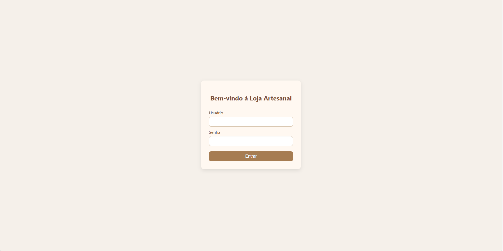
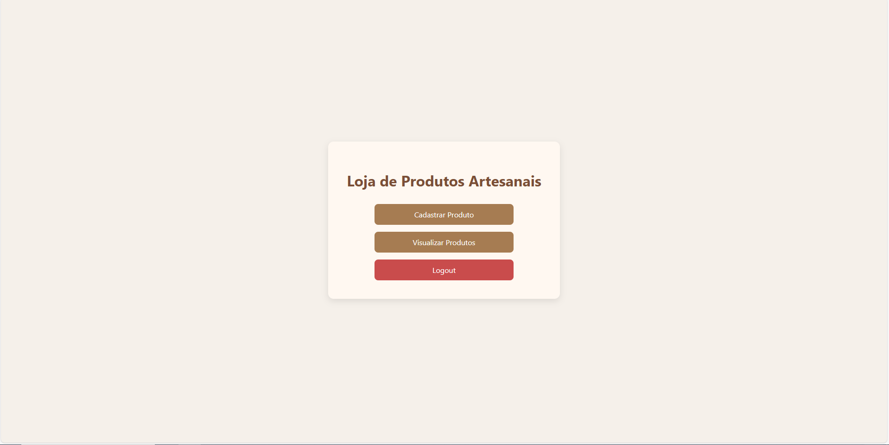
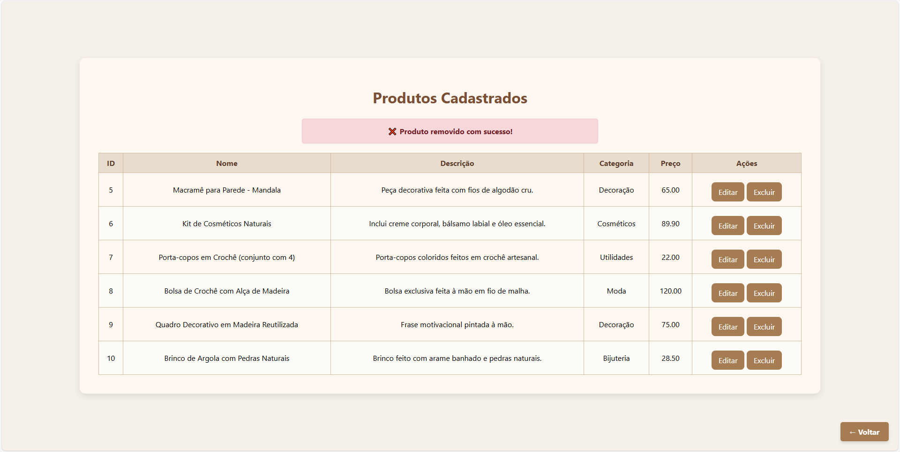

# 🧶 Loja de Produtos Artesanais — Avaliação 2 (FATEC Desenvolvimento Web II)

Este projeto consiste em um sistema web desenvolvido em **PHP com orientação a objetos**, utilizando **MySQL (via PDO)** para persistência de dados. Ele permite a um lojista realizar a **gestão do catálogo de produtos** de sua loja artesanal após efetuar login no sistema.

📌 Repositório avaliado para a disciplina **Desenvolvimento Web II** (Prof. Orlando) - **2ª Avaliação de 2025**.

---

## 📸 Demonstrações Visuais

### 🔐 Página de Login



---

### 🏠 Página Inicial com Botões Centrais



---

### 📝 Cadastro de Produtos


---

### 📦 Listagem dos Produtos



---

---

### 📦 Listagem dos Produtos


---

### ✅ Alertas de Sucesso

Mensagens de feedback visual são exibidas para as ações de cadastro, edição e exclusão:

- Produto cadastrado com sucesso ✅
- Produto editado com sucesso ✏️
- Produto removido com sucesso ❌

---

## 🧩 Funcionalidades

| Funcionalidade      | Descrição |
|---------------------|-----------|
| 🔐 Login / Logout   | Apenas usuários autenticados podem acessar o sistema |
| 📝 Cadastrar Produto| Nome, Preço, Descrição e Categoria |
| 📄 Visualizar       | Listagem completa dos produtos cadastrados |
| 🗑️ Remover Produto | Remoção segura por ID |
| ✏️ Editar Produto   | Atualização de informações de produto |
| ✅ Alertas Visuais  | Sistema unificado de alertas por ação |

---

## 📚 Tecnologias Utilizadas

- HTML5, CSS3 (sem frameworks)
- PHP 8 com Orientação a Objetos
- PDO (PHP Data Objects)
- MySQL
- Git + GitHub

---

## 🛠 Estrutura do Projeto
```
/
├── index.php                      # Página inicial
├── login.php                      # Página de login
├── principal.php                  # Página principal após o login
├── metodos/                       # Diretório contendo os métodos de manipulação
│   ├── delete.php                 # Método para remover produtos
│   ├── edit.php                   # Método para editar produtos
│   ├── insert.php                 # Método para inserir novos produtos
│   └── login.php                  # Método de login
├── css/                           # Diretório de arquivos CSS
│   ├── crud.css                   # Estilos para as páginas de CRUD
│   ├── principal.css              # Estilos específicos para a página principal
│   └── style.css                  # Estilos gerais do site
├── CRUD/                          # Diretório contendo os arquivos de CRUD
│   ├── edit.php                   # Arquivo para edição de produtos
│   ├── index.php                  # Arquivo para exibir a lista de produtos
│   └── new.php                    # Arquivo para criação de novos produtos
├── classes/                       # Diretório contendo as classes PHP
│   └── db.php                     # Classe de conexão e manipulação de dados (PDO)
├── partials/                      # Arquivos reutilizáveis
│   └── session_verify.php         # Verifica se o usuário está logado
├── imagem/                        # Imagens utilizadas no projeto
│   ├── cadastro.png               # Tela de cadastro
│   ├── editar.png                 # Tela de edição
│   ├── listar.png                 # Tela de listagem
│   ├── login.png                  # Tela de login
│   └── principal.png              # Tela principal após login
```
